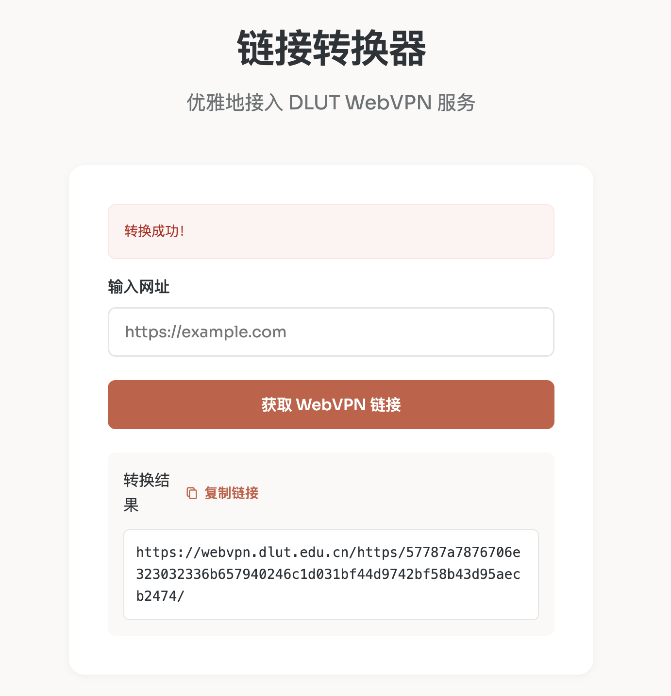

# DLUT WebVPN URL 转换器

一个简单优雅的工具，用于将普通 URL 转换为大连理工大学 WebVPN 可访问的 URL。本项目的实现参考了 [ESWZY/webvpn-dlut](https://github.com/ESWZY/webvpn-dlut)，在其基础上进行了界面优化和功能改进。

## 项目背景

`webvpn.dlut.edu.cn` 是大连理工大学的 WebVPN 服务，提供了从校外访问校园网环境资源的接口。本项目提供了一个便捷的 Web 界面，帮助用户快速生成可访问的 WebVPN 链接。

## 技术细节

- 加密方法：AES-128-CFB
- 系统类型：网瑞达科技的资源访问控制系统（WebVPN）

## 功能特点

- 🚀 快速将普通 URL 转换为 WebVPN URL
- ⚡ 基于 Vercel 部署，访问快速
- 🌐 支持所有校内资源链接转换
<p align="center">
  
</p>

## DEMO

访问：https://vpn.dlut.tech/

## 快速部署

[](https://vercel.com/new/clone?repository-url=https://github.com/LittlePorcupine/dlut-webvpn-web&project-name=dlut-webvpn-converter&repository-name=dlut-webvpn-converter)

只需点击上方按钮，即可一键部署到 Vercel：

1. 点击按钮跳转至 Vercel
2. 使用 GitHub 账号登录（如果需要）
3. 设置项目名称
4. 点击 Deploy 开始部署

部署完成后，Vercel 会自动分配一个域名，您也可以绑定自己的自定义域名。

## 技术栈

- 后端：Flask
- 前端：原生 JavaScript
- 加密：pycryptodome (AES-CFB)
- 部署：Vercel

## 项目结构

```
.
├── api/
│   └── index.py          # 主要的应用逻辑
├── templates/
│   └── index.html        # 前端页面
├── requirements.txt      # Python 依赖
└── vercel.json          # Vercel 配置
```

## 安全性说明

本项目使用 AES-CFB 模式进行加密，密钥和向量已经在代码中配置。

## 贡献指南

欢迎提交 Issue 和 Pull Request。

## 开源协议

[MIT 许可证](LICENSE)

## 致谢

- [ESWZY/webvpn-dlut](https://github.com/ESWZY/webvpn-dlut) - 本项目的核心实现参考
- 感谢大连理工大学提供的 WebVPN 服务
- [dlut-survival-tools](https://github.com/NAOSI-DLUT/dlut-survival-tools) - 一些与大连理工大学相关的工具集

## 免责声明

本项目仅供学习研究使用，不得用于非法用途。使用本项目所产生的一切后果由使用者自行承担。
